### Termos e acordos

Ao iniciar este projeto, você concorda com as diretrizes do Código de Ética e Conduta e do Manual da Pessoa Estudante da Trybe

# Boas vindas ao repositório do projeto Store Manager!

Você já usa o GitHub diariamente para desenvolver os exercícios, certo? Agora, para desenvolver os projetos, você deverá seguir as instruções a seguir. Fique atento a cada passo, e se tiver qualquer dúvida, nos envie por Slack! #vqv 🚀

Aqui você vai encontrar os detalhes de como estruturar o desenvolvimento do seu projeto a partir deste repositório, utilizando uma branch específica e um Pull Request para colocar seus códigos.

---

# Sumário

- [Habilidades](#habilidades)
- [Entregáveis](#entregáveis)
  - [O que deverá ser desenvolvido](#o-que-deverá-ser-desenvolvido)
  - [Desenvolvimento](#desenvolvimento)
  - [Data de entrega](#data-de-entrega)
- [Instruções para entregar seu projeto](#instruções-para-entregar-seu-projeto)
  - [Antes de começar a desenvolver](#antes-de-começar-a-desenvolver)
  - [Durante o desenvolvimento](#durante-o-desenvolvimento)
- [Como desenvolver](#como-desenvolver)
  - [Padrões e conexões](#padrões-e-conexões)
  - [Conexão com o Banco](#conexão-com-o-banco)
  - [Tabelas](#tabelas)
- [Requisitos do projeto](#requisitos-do-projeto)
  - [Linter](#linter)
  - [Lista de requisitos](#lista-de-requisitos)

    `Obrigatórios`
    - [1 - Crie um endpoint para o cadastro de produtos](#1---crie-um-endpoint-para-o-cadastro-de-produtos)
    - [2 - Crie um endpoint para listar os produtos](#2---crie-um-endpoint-para-listar-os-produtos)
    - [3 - Crie um endpoint para atualizar um produto](#3---crie-um-endpoint-para-atualizar-um-produto)
    - [4 - Crie um endpoint para deletar um produto](#4---crie-um-endpoint-para-deletar-um-produto)
    - [5 - Crie um endpoint para cadastrar vendas](#5---crie-um-endpoint-para-cadastrar-vendas)
    - [6 - Crie um endpoint para listar as vendas](#6---crie-um-endpoint-para-listar-as-vendas)
    - [7 - Crie um endpoint para atualizar uma venda](#7---crie-um-endpoint-para-atualizar-uma-venda)
    - [8 - Crie um endpoint para deletar uma venda](#8---crie-um-endpoint-para-deletar-uma-venda)
    - [9 - Atualize a quantidade de produtos](#9---atualize-a-quantidade-de-produtos)
    - [10 - Valide a quantidade de produtos](#10---valide-a-quantidade-de-produtos)

    `Bônus`
    
    - [11 - Escreva testes para seus models](#11---escreva-testes-para-seus-models)
    - [12 - Escreva testes para seus services](#12---escreva-testes-para-seus-services)
    - [13 - Escreva testes para seus controllers](#13---escreva-testes-para-seus-controllers)
- [Depois de terminar o desenvolvimento](#depois-de-terminar-o-desenvolvimento)
- [Revisando um pull request](#revisando-um-pull-request)
- [Avisos Finais](#avisos-finais)

---

# Habilidades

Nesse projeto, você será capaz de:

- Entender o funcionamento da camada de Model;
- Delegar responsabilidades específicas para essa camada;
- Conectar sua aplicação com diferentes bancos de dados;
- Estruturar uma aplicação em camadas;
- Delegar responsabilidades específicas para cada parte do seu app;
- Melhorar manutenibilidade e reusabilidade do seu código;
- Entender e aplicar os padrões REST;
- Escrever assinaturas para APIs intuitivas e facilmente entendíveis.

# Entregáveis

Para entregar o seu projeto você deverá criar um Pull Request neste repositório.

Lembre-se que você pode consultar nosso conteúdo sobre
[Git & GitHub](https://course.betrybe.com/intro/git/) sempre que precisar!

---

## O que deverá ser desenvolvido

Você vai desenvolver sua primeira API utilizando a arquitetura MSC!

A API a ser construída trata-se de um sistema de gerenciamento de vendas, onde será possível criar, visualizar, deletar e atualizar produtos e vendas.

---

## Desenvolvimento

Você vai desenvolver todas as camadas da API (Models, Services caso necessário, e Controllers).

Através dessa aplicação, será possível realizar as operações básicas que se pode fazer em um determinado banco de dados: Criação, Leitura, Atualização e Exclusão (ou `CRUD`, para as pessoas mais mais íntimas 😜).

Você deve utilizar o banco MongoDB para a gestão de dados. Além disso, a API deve ser RESTful.

⚠️ **Dicas Importantes** ⚠️:

- Deve ser possível que a pessoa usuária, independente de cadastramento ou login, possa adicionar, ler, deletar e atualizar produtos no seu estoque. O usuário deve poder também enviar vendas para o sistema. Essas vendas devem validar se o produto em questão existe. Deve, também, ser possível ler, deletar e atualizar vendas.

- Para **todos os endpoints** garanta que:

  - Caso o recurso não seja encontrado, sua API retorne o status HTTP adequado com o body `{ message: '<recurso> não encontrado' }`.
  - Em caso de erro, sua API retorne o status HTTP adequado com o body `{ err: { message: <mensagem de erro>, code: <código do erro> } }`.
    - O código do erro deve ser determinado por você e deve seguir o mesmo padrão para toda a aplicação. Por exemplo: `'not_found'`, `'invalid_data'` e afins.
  - Em caso de dados inválidos, sua API retorne o status HTTP adequado, com o body `{ err: { message: 'Dados inválidos', code: <código do erro> } }`.
  - Todos os retornos de erro devem seguir o mesmo formato. Para erros que requerem dados adicionais (por exemplo, para informar quais campos estão incorretos) utilize a propriedade `data` dentro do objeto `err`.
  - Para gerar os objetos de erro personalizados, você pode utilizar uma biblioteca de erros, como o [`boom`](https://www.npmjs.com/package/@hapi/boom).

- Você pode utilizar middlewares e objetos de erro personalizados para que não tenha que repetir a lógica de tratamento de erro em vários lugares. Não se esqueça também do [express-rescue](https://www.npmjs.com/package/express-rescue), ele pode facilitar muito o trabalho de tratar erros.

- Quando estiver na dúvida sobre qual status HTTP utilizar, você pode consultar sites como o [httpstatuses.com](https://httpstatuses.com/), [restapitutorial.com](https://www.restapitutorial.com/httpstatuscodes.html) ou a [documentação sobre o assunto no MDN](https://developer.mozilla.org/pt-BR/docs/Web/HTTP/Status). Com o tempo, você vai lembrar com facilidade o significado dos códigos mais comuns.

- Para realizar a validação dos dados, você pode utilizar middlewares como [`Joi`](https://www.npmjs.com/package/@hapi/joi) ou o [`Expresso Validator`](https://www.npmjs.com/package/@expresso/validator). Caso prefira, você também pode realizar a validação de forma manual.

---

## Data de Entrega

  - Serão `3` dias de projeto.
  - Data de entrega para avaliação final do projeto: `21/09/2021 - 14:00h`.

---

# Instruções para entregar seu projeto

## Antes de começar a desenvolver

1. Clone o repositório

- `git clone https://github.com/tryber/sd-010-b-store-manager.git`.
- Entre na pasta do repositório que você acabou de clonar:
  - `cd sd-010-b-store-manager`

2. Instale as dependências [**Caso existam**]

- `npm install`

Atenção :warning: Não rode o comando npm audit fix! Ele atualiza várias dependências do projeto, e essa atualização gera conflitos com o avaliador.

3. Crie uma branch a partir da branch `master`

- Verifique que você está na branch `master`
  - Exemplo: `git branch`
- Se não estiver, mude para a branch `master`
  - Exemplo: `git checkout master`
- Agora crie uma branch à qual você vai submeter os `commits` do seu projeto
  - Você deve criar uma branch no seguinte formato: `nome-de-usuario-nome-do-projeto`
  - Exemplo: `git checkout -b joaozinho-sd-010-b-store-manager`

4. Adicione as mudanças ao _stage_ do Git e faça um `commit`

- Verifique que as mudanças ainda não estão no _stage_
  - Exemplo: `git status` (deve aparecer listada a pasta _joaozinho_ em vermelho)
- Adicione o novo arquivo ao _stage_ do Git
  - Exemplo:
    - `git add .` (adicionando todas as mudanças - _que estavam em vermelho_ - ao stage do Git)
    - `git status` (deve aparecer listado o arquivo _joaozinho/README.md_ em verde)
- Faça o `commit` inicial
  - Exemplo:
    - `git commit -m 'iniciando o projeto x'` (fazendo o primeiro commit)
    - `git status` (deve aparecer uma mensagem tipo _nothing to commit_ )

5. Adicione a sua branch com o novo `commit` ao repositório remoto

- Usando o exemplo anterior: `git push -u origin joaozinho-sd-010-b-store-manager`

6. Crie um novo `Pull Request` _(PR)_

- Vá até a página de _Pull Requests_ do [repositório no GitHub](https://github.com/tryber/sd-010-b-store-manager/pulls)
- Clique no botão verde _"New pull request"_
- Clique na caixa de seleção _"Compare"_ e escolha a sua branch **com atenção**
- Clique no botão verde _"Create pull request"_
- Adicione uma descrição para o _Pull Request_ e clique no botão verde _"Create pull request"_
- **Não se preocupe em preencher mais nada por enquanto!**
- Volte até a [página de _Pull Requests_ do repositório](https://github.com/tryber/sd-010-b-store-manager/pulls) e confira que o seu _Pull Request_ está criado

---

## Durante o desenvolvimento

* ⚠ **PULL REQUESTS COM ISSUES NO LINTER NÃO SERÃO AVALIADAS, ATENTE-SE PARA RESOLVÊ-LAS ANTES DE FINALIZAR O DESENVOLVIMENTO!** ⚠

* Faça `commits` das alterações que você fizer no código regularmente

* Lembre-se de sempre após um (ou alguns) `commits` atualizar o repositório remoto

* Os comandos que você utilizará com mais frequência são:
  1. `git status` _(para verificar o que está em vermelho - fora do stage - e o que está em verde - no stage)_
  2. `git add` _(para adicionar arquivos ao stage do Git)_
  3. `git commit` _(para criar um commit com os arquivos que estão no stage do Git)_
  5. `git push -u nome-da-branch` _(para enviar o commit para o repositório remoto na primeira vez que fizer o `push` de uma nova branch)_
  4. `git push` _(para enviar o commit para o repositório remoto após o passo anterior)_

---

# Como desenvolver

## Padrões e conexões

## ⚠️ Leia-os atentamente e siga à risca o que for pedido. ⚠️

### Todos os seus endpoints devem estar no padrão REST

- Use os verbos HTTP adequados para cada operação.

- Agrupe e padronize suas URL em cada recurso.

- Garanta que seus endpoints sempre retornem uma resposta, havendo sucesso nas operações ou não.

- Retorne os códigos de status corretos (recurso criado, erro de validação, autorização, etc).

### Cada camada da sua API deve estar em sua respectiva pasta

- Models devem estar na pasta `models`, **na raiz do projeto**

- Services devem estar na pasta `services`, **na raiz do projeto**

- Controllers devem estar na pasta `controllers`, **na raiz do projeto**

### Arquivo index.js

Há um arquivo `index.js` no repositório. Não remova, nele, o seguinte trecho de código:

```javascript
app.get('/', (request, response) => {
  response.send();
});
```

Isso está configurado para o avaliador funcionar.

### Conexão com o Banco:

A conexão do banco local deverá conter os seguintes parâmetros:

```javascript
const MONGO_DB_URL = 'mongodb://localhost:27017/StoreManager';
const DB_NAME = 'StoreManager';
```

Para o avaliador funcionar altere a conexão do banco para:

```javascript
const MONGO_DB_URL = 'mongodb://mongodb:27017/StoreManager';
const DB_NAME = 'StoreManager';
```

### Tabelas

O banco terá duas tabelas: produtos e vendas

A tabela de produtos deverá ter o seguinte nome: `products`

Os campos da tabela `products` terão esse formato:

```json
{ "name": "Produto Silva", "quantity": 10 }
```

A resposta do insert que deve retornar após a criação é parecida essa:

```json
{ "_id": ObjectId("5f43cbf4c45ff5104986e81d"), "name": "Produto Silva", "quantity": 10 }
```

(O \_id será gerado automaticamente)

A tabela de vendas deverá ter o seguinte nome: `sales`

Os campos da tabela `sales` terão esse formato:

```json
{ "itensSold": [{ "productId": "5f43cbf4c45ff5104986e81d", "quantity": 2 }] }
```

A resposta do insert que deve retornar após a criação é parecida essa:

```json
{
  "_id": ObjectId("5f43cc53c45ff5104986e81e"),
  "itensSold": [{ "productId": "5f43cbf4c45ff5104986e81d", "quantity": 2 }]
}
```

(O \_id será gerado automaticamente)

# Requisitos do projeto

## Linter

Usaremos o [ESLint](https://eslint.org/) para fazer a análise estática do seu código.

Este projeto já vem com as dependências relacionadas ao _linter_ configuradas no arquivos `package.json`.

Para poder rodar os `ESLint` em um projeto basta executar o comando `npm install` dentro do projeto e depois `npm run lint`. Se a análise do `ESLint` encontrar problemas no seu código, tais problemas serão mostrados no seu terminal. Se não houver problema no seu código, nada será impresso no seu terminal.

Você pode também instalar o plugin do `ESLint` no `VSCode`, bastar ir em extensions e baixar o [plugin `ESLint`](https://marketplace.visualstudio.com/items?itemName=dbaeumer.vscode-eslint).

---

## Testes

Usaremos o [Jest]() e o [Frisby] para fazer os testes de api.

Este projeto já vem configurado e com suas dependências

Para poder executar os testes basta executar comando `npm tests` e o resultado será igual o abaixo:

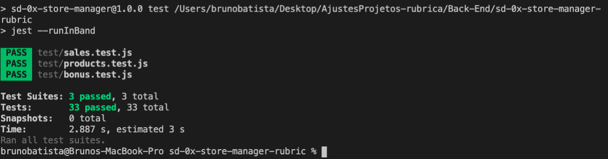

## Dica: desativando testes

Especialmente no início, quando a maioria dos testes está falhando, a saída após executar os testes é bastante poluída. Você pode desabilitar temporariamente um teste utilizando a função `skip` junto à função `it`. Como o nome indica, esta função "pula" um teste:

```js
it.skip('it includes the text `Movie Cards Library` inside a h1 tag', () => {
  wrapper = shallow(<Header />);

  expect(wrapper.find('header h1').text()).toBe('Movie Cards Library');
});
```

Na saída da execução dos testes, você verá um  indicando que o teste está sendo pulado:


Uma estratégia é pular todos os testes no início e ir implementando um teste de cada vez, removendo dele a função `skip`.

⚠️ Lembre-se de não entregar o projeto com nenhum teste ignorado. Testes ignorados serão tratados como testes falhando.

## Lista de requisitos

### 1 - Crie um endpoint para o cadastro de produtos

- O endpoint deve ser acessível através do caminho (`/products`);

- Os produtos enviados devem ser salvos em uma **collection** do MongoDB;

- O endpoint deve receber a seguinte estrutura:

```json
{
  "name": "product_name",
  "quantity": "product_quantity"
}
```

O retorno da API de um produto cadastrado com sucesso deverá ser:

```json
{
  "_id": "5f43a7ca92d58904914656b6",
  "name": "Produto do Batista",
  "quantity": 100
}
```

#### Requisição de Cadastro de Produtos:

O projeto deve rodar na porta `http://localhost:3000`


#### Observações Técnicas:

- `name` deve ser uma _string_ com mais de 5 caracteres e deve ser único;

- `quantity` deve ser um número inteiro maior que 0;

- Cada produto deve ter um id que seja único e gerado no momento em que o recurso for criado. Você pode utilizar o ID gerado pelo MongoDB

- A resposta do endpoint em caso de sucesso deve ser o produto criado.

**O que será verificado:**

- Será validado que não é possível criar um produto com o nome menor que 5 caracteres
  - Se o produto tiver o nome menor que cinco caracteres o resultado retornado deverá ser conforme exibido abaixo, com um status http `422`:

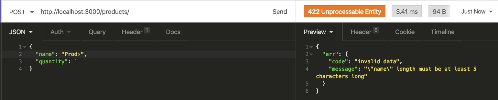
(As contrabarras `\` estão escapando as aspas de dentro da string)

- Será validado que não é possível criar um produto com o mesmo nome de outro já existente

  -  Se o produto tiver o mesmo nome o resultado retornado deverá ser conforme exibido abaixo, com status http `422`:

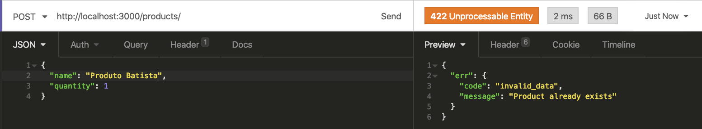

- Será validado que não é possível criar um produto com quantidade menor que zero

    - Se o produto tiver uma quantidade menor que zero o resultado retornado deverá ser conforme exibido abaixo, com status http `422`:

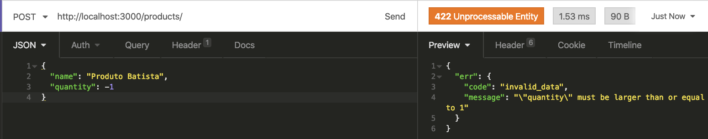
(As contrabarras `\` estão escapando as aspas de dentro da string)

- Será validado que não é possível criar um produto com quantidade igual a zero

  - Se o produto tiver uma quantidade igual a zero o resultado retornado deverá ser conforme exibido abaixo, com status http `422`:

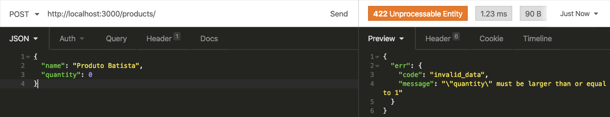
(As contrabarras `\` estão escapando as aspas de dentro da string)

- Será validado que não é possível criar um produto com uma string no campo quantidade

  - Se o produto tiver uma quantidade com o valor em string o resultado retornado deverá ser conforme exibido abaixo, com status http `422`:

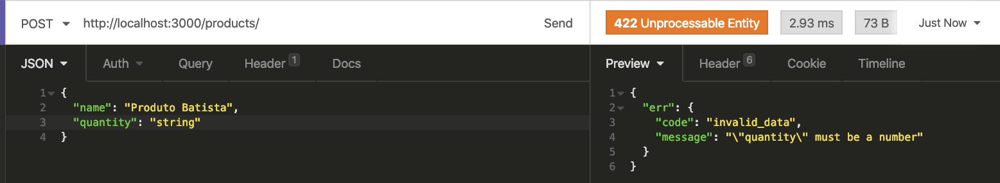
(As contrabarras `\` estão escapando as aspas de dentro da string)

- Será validado que é possível criar um produto com sucesso

  - Se o produto for cadastrado com sucesso o resultado retornado deverá ser conforme exibido abaixo, com status http `201`:


### 2 - Crie um endpoint para listar os produtos

- O endpoint deve ser acessível através do caminho (`/products`) ou (`/products/:id`);

- Através do caminho `/products`, todos os produtos devem ser retornados;

- Através do caminho `/products/:id`, apenas o produto com o `id` presente na URL deve ser retornado;

**O que será verificado:**

- Será validado que todos produtos estão sendo retornados

  - Se a lista retornar com sucesso, o resultado retornado deverá ser conforme exibido abaixo, com status http `200`:

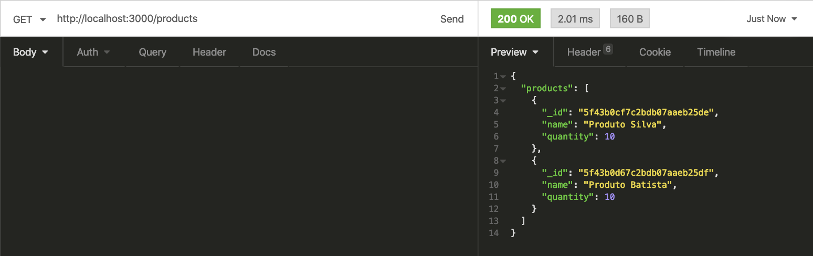

- Será validado que é possível listar um determinado produto

  - Se a lista retornar com sucesso, o resultado retornado deverá ser conforme exibido abaixo, com status http `200`:

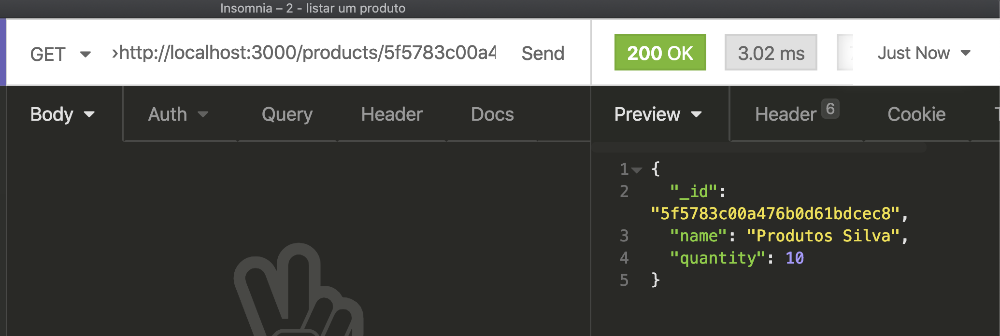

- Será validado que não é possível listar um produto que não existe

  - Se a lista retornar com falha, o resultado retornado deverá ser conforme exibido abaixo, com status http `422`:

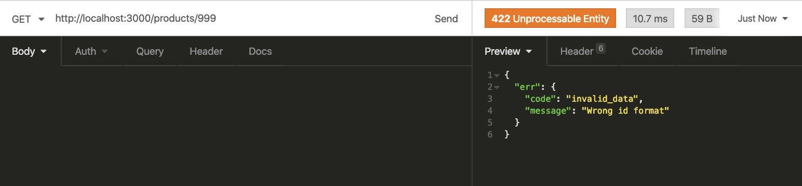

### 3 - Crie um endpoint para atualizar um produto

- O endpoint deve ser acessível através do caminho (`/products/:id`);

- O corpo da requisição deve seguir a mesma estrutura do método responsável por adicionar um produto;

- Apenas o produto com o `id` presente na URL deve ser atualizado;

**O que será verificado:**

- Será validado que não é possível atualizar um produto com o nome menor que 5 caracteres

  - Se o produto tiver o nome menor que cinco caracteres, o resultado retornado deverá ser conforme exibido abaixo, com status `422`:

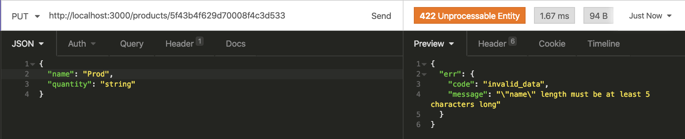
(As contrabarras `\` estão escapando as aspas de dentro da string)

- Será validado que não é possível atualizar um produto com quantidade menor que zero

  - Se o produto tiver o quantidade menor que zero, o resultado retornado deverá ser conforme exibido abaixo, com status http `422`:

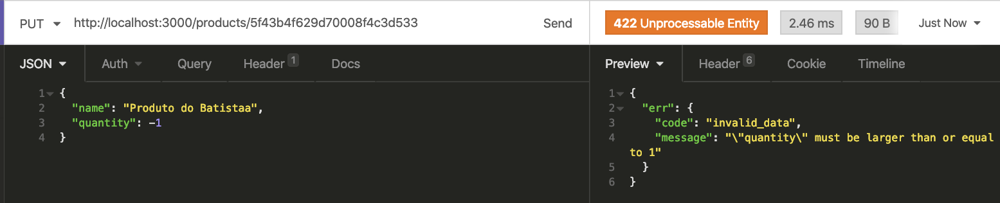
(As contrabarras `\` estão escapando as aspas de dentro da string)

- Será validado que não é possível atualizar um produto com quantidade igual a zero

  - Se o produto tiver o quantidade igual a zero, o resultado mostrado deverá ser conforme exibido abaixo, com status http `422`:

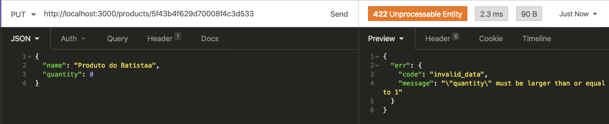
(As contrabarras `\` estão escapando as aspas de dentro da string)

- Será validado que não é possível atualizar um produto com uma string no campo quantidade

  - Se o produto tiver o quantidade como string, o resultado retornado deverá ser conforme exibido abaixo, com status http `422`:

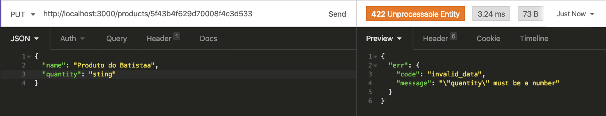
(As contrabarras `\` estão escapando as aspas de dentro da string)

- Será validado que é possível atualizar um produto com sucesso]**

  - Se o produto atualizado com sucesso, o resultado mostrretornadoado deverá ser conforme exibido abaixo, com status http `200`:

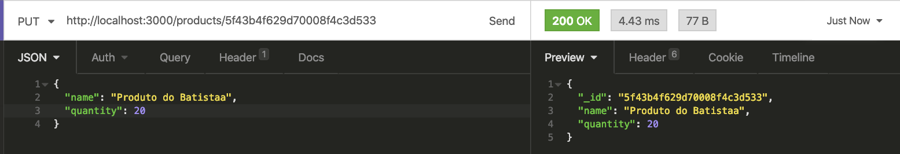

### 4 - Crie um endpoint para deletar um produto

- O endpoint deve ser acessível através do caminho (`/products/:id`);

- Apenas o produto com o `id` presente na URL deve ser deletado;

**O que será verificado:**

- Será validado que é possível deletar um produto com sucesso

  - Se o produto deletado com sucesso, o resultado retornado deverá ser conforme exibido abaixo, com status http `200`:


- Será validado que não é possível deletar um produto que não existe

  - Se o produto não for deletado com sucesso, o resultado retornado deverá ser esse e com status http `422`:

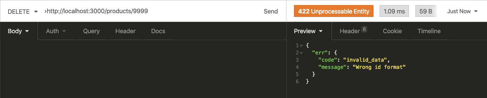

### 5 - Crie um endpoint para cadastrar vendas

- O endpoint deve ser acessível através do caminho (`/sales`);

- As vendas enviadas devem ser salvas em uma `collection` do MongoDB;

- Deve ser possível cadastrar a venda de vários produtos através da uma mesma requisição;

- O endpoint deve receber a seguinte estrutura:

```json
[
  {
  "productId": "product_id",
  "quantity": "product_quantity",
  },
  ...
]
```

O retorno de uma venda cadastrada com sucesso deverá ser:

```json
{
  "_id": "5f43ba333200020b101fe4a0",
  "itensSold": [
    {
      "productId": "5f43ba273200020b101fe49f",
      "quantity": 2
    }
  ]
}
```

#### Observações Técnicas:

- O `productId` devem ser igual ao `id` de um produto anteriormente cadastrado;

- `quantity` deve ser um número inteiro maior que 0;

- Cada venda deve ter um id que seja único e gerado no momento em que o recurso for criado;

- A resposta do endpoint em caso de sucesso deve ser a(s) venda(s) criada(s).

**O que será verificado:**

- Será validado que não é possível cadastrar vendas com quantidade menor que zero

  - Se a venda tiver uma quantidade menor que zero, o resultado retornado deverá ser conforme exibido abaixo, com status http `422`:


- Será validado que não é possível cadastrar vendas com quantidade igual a zero

  - Se a venda tiver uma quantidade igual a zero, o resultado retornado deverá ser conforme exibido abaixo, com status http `422`:

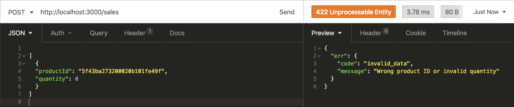

- Será validado que não é possível cadastrar vendas com uma string no campo quantidade

  - Se a venda tiver uma quantidade com valor, o resultado retornado deverá ser conforme exibido abaixo, com status http `422`:

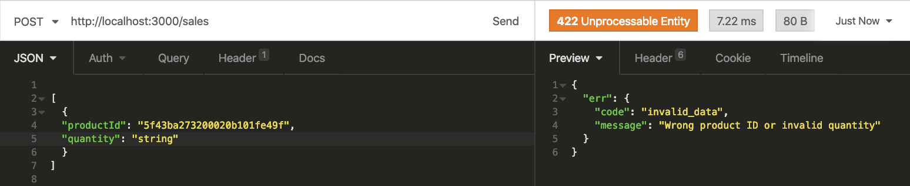

- Será validado que é possível criar uma venda com sucesso

  - Se a venda foi feita com sucesso, o resultado retornado deverá ser conforme exibido abaixo, com status http `200`:

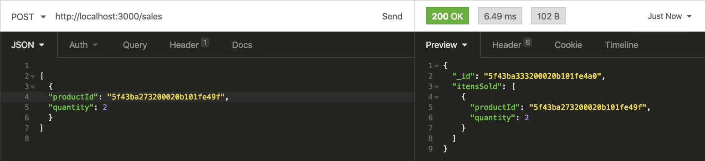

- Será validado que é possível criar várias vendas com sucesso

  - Se as vendas foi feita com sucesso, o resultado retornado deverá ser conforme exibido abaixo, com status http `200`:

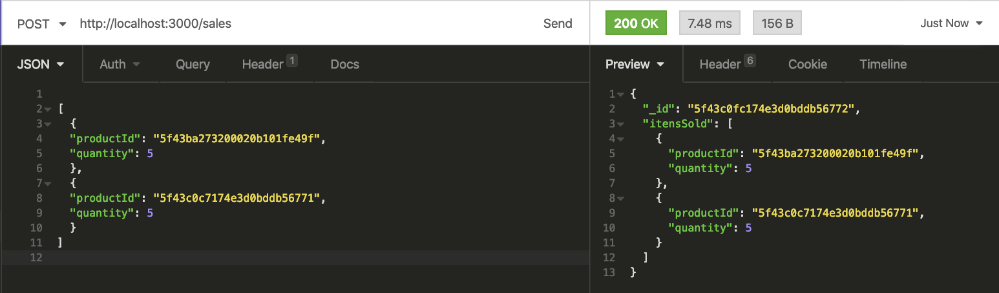

### 6 - Crie um endpoint para listar as vendas

- O endpoint deve ser acessível através do caminho (`/sales`) ou (`/sales/:id`);

- Através do caminho `/sales`, todas as vendas devem ser retornadas;

- Através do caminho `/sales/:id`, apenas a venda com o `id` presente na URL deve ser retornada;

**O que será verificado:**

- Será validado que todas as vendas estão sendo retornadas

  - Se todas vendas estão sendo listadas, o resultado retornado deverá ser conforme exibido abaixo, com status http `200`:

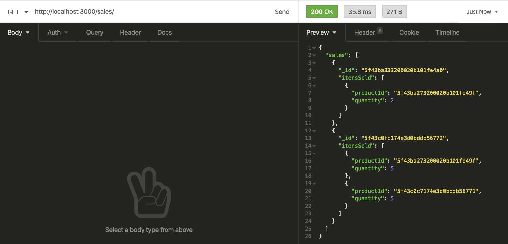

- Será validado que é possível listar uma determinada venda

 - Se a venda esta sendo listada, o resultado retornado deverá ser conforme exibido abaixo, com status http `200`:

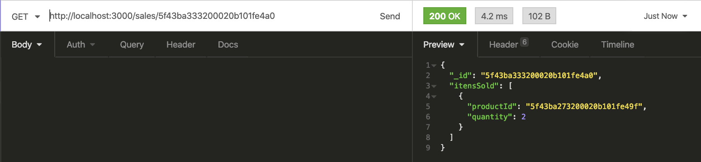

- Será validado que não é possível listar uma venda inexistente

  - Se a venda não esta sendo listada, o resultado retornado deverá ser conforme exibido abaixo, com status http `404`:

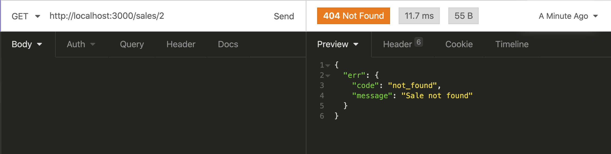

### 7 - Crie um endpoint para atualizar uma venda

- O endpoint deve ser acessível através do caminho (`/sales/:id`);

- O corpo da requisição deve receber a seguinte estrutura:

```json
[
  {
    "productId": "5f3ff849d94d4a17da707008",
    "quantity": 3
  }
]
```

- `quantity` deve ser um número inteiro maior que 0;

- Apenas a venda com o `id` presente na URL deve ser atualizada;

**O que será verificado:**

- Será validado que não é possível atualizar vendas com quantidade menor que zero

  - Se a venda tiver uma quantidade menor que zero, o resultado retornado deverá ser conforme exibido abaixo, com status http `422`:

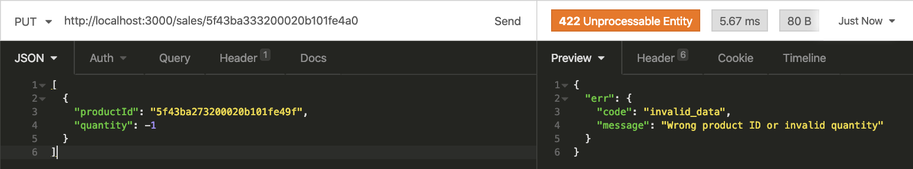

- Será validado que não é possível atualizar vendas com quantidade igual a zero

  - Se a venda tiver uma quantidade igual a zero, o resultado retornado deverá ser conforme exibido abaixo, com status http `422`:

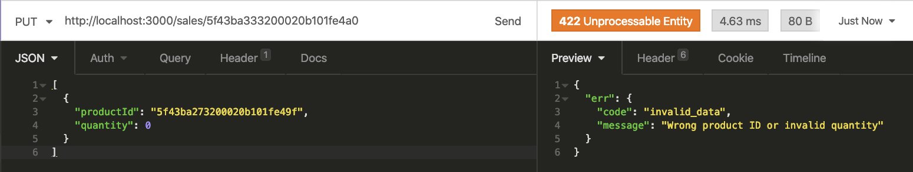

- Será validado que não é possível atualizar vendas com uma string no campo quantidade

  - Se a venda tiver uma quantidade do tipo string, o resultado retornado deverá ser conforme exibido abaixo, com status http `422`:


- Será validado que é possível atualizar uma vendas com sucesso

  - Se a venda for atualizada com sucesso, o resultado retornado deverá ser conforme exibido abaixo, com status http `200`:

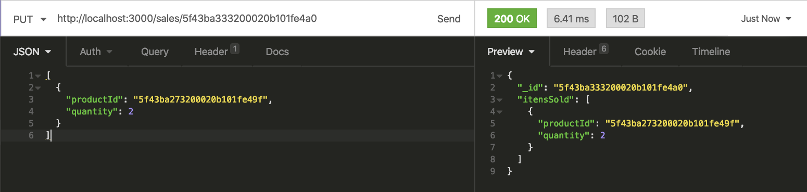

### 8 - Crie um endpoint para deletar uma venda

- O endpoint deve ser acessível através do caminho (`/sales/:id`);

- Apenas a venda com o `id` presente na URL deve ser deletado;

**O que será verificado:**

- Será validado que é possível deletar uma venda com sucesso

  - Se a venda foi deletada sucesso, o resultado retornado deverá ser conforme exibido abaixo, com status http `200` e será verificado depois que a venda não existe, com um GET nesse `id`, e este deverá retornar status http `404`, como é validado no requisito 6:

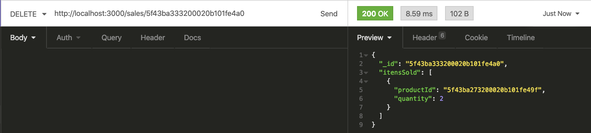

- Será validado que não é possível deletar uma venda que não existe

  - Se a venda não foi deletada sucesso, o resultado retornado deverá ser conforme exibido abaixo, com status http `422`:

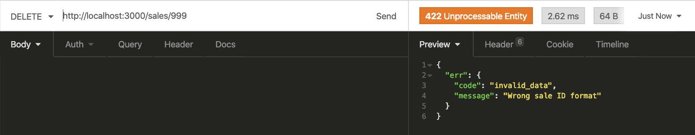

### 9 - Atualize a quantidade de produtos

- Ao realizar uma venda, atualizá-la ou deletá-la, você deve também atualizar a quantidade do produto em questão presente na `collection` responsável pelos produtos;

- Por exemplo: suponha que haja um produto chamado _Bola de Futebol_ e a sua propriedade `quantity` tenha o valor _10_. Caso seja feita uma venda com _8_ unidades desse produto, a quantidade do produto deve ser atualizada para _2_ , pois 10 - 8 = 2;

**O que será verificado:**

- Será validado que é possível a quantidade do produto atualize ao fazer uma compra

  - Ao fazer uma determinada venda, a quantidade do produto deverá ser atualizada.

- Será validado que é possível a quantidade do produto atualize ao deletar uma compra

  - Ao fazer deletar uma determinada venda, a quantidade do produto deverá ser atualizada para a quantidade que tinha antes de ter feito essa venda.

### 10 - Valide a quantidade de produtos

- Um produto nunca deve ter a quantidade em estoque menor que 0;

- Quando uma venda for realizada, garanta que a quantidade sendo vendida está disponível no estoque

**O que será verificado:**

- Será validado que o estoque do produto nunca fique com a quantidade menor que zero

  - Um produto não poderá ficar com a quantidade menor que zero, o resultado retornado deverá ser conforme exibido abaixo, com status http `404`:

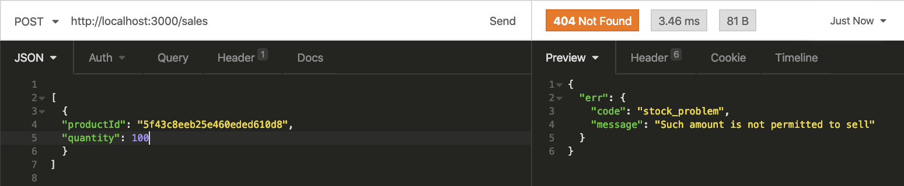

## Bônus

## 11 - Escreva testes para seus models

- Utilize o mocha, chai e sinon para escrever seus testes

- Coloque todos os testes de models no arquivo `test/unit/models.js`

- Será validado que cobertura total das linhas dos arquivos na pasta `models` é maior ou igual a 80%

## 12 - Escreva testes para seus services

- Utilize o mocha, chai e sinon para escrever seus testes

- Coloque todos os testes de services no arquivo `test/unit/services.js`

- Será validado que cobertura total das linhas dos arquivos na pasta `services` é maior ou igual a 80%

## 13 - Escreva testes para seus controllers

- Utilize o mocha, chai e sinon para escrever seus testes

- Coloque todos os testes de controllers no arquivo `test/unit/controllers.js`

- Será validado que cobertura total das linhas dos arquivos na pasta `controllers` é maior ou igual a 80%

---

## Depois de terminar o desenvolvimento

Para **"entregar"** seu projeto, siga os passos a seguir:

* Vá até a página **DO SEU** _Pull Request_, adicione a label de _"code-review"_ e marque seus colegas
  * No menu à direita, clique no _link_ **"Labels"** e escolha a _label_ **code-review**
  * No menu à direita, clique no _link_ **"Assignees"** e escolha **o seu usuário**
  * No menu à direita, clique no _link_ **"Reviewers"** e digite `students`, selecione o time `tryber/students-sd-00`

Se ainda houver alguma dúvida sobre como entregar seu projeto, [aqui tem um video explicativo](https://vimeo.com/362189205).

⚠ Lembre-se que garantir que todas as _issues_ comentadas pelo **Lint** estão resolvidas! ⚠

---

## Revisando um pull request

À medida que você e as outras pessoas que estudam na Trybe forem entregando os projetos, vocês receberão um alerta via Slack para também fazer a revisão dos Pull Requests dos seus colegas. Fiquem atentos às mensagens do "Pull Reminders" no Slack!

Use o material que você já viu sobre [Code Review](https://course.betrybe.com/real-life-engineer/code-review/) para te ajudar a revisar os projetos que chegaram para você.

---

# Avisos finais

Ao finalizar e submeter o projeto, não se esqueça de avaliar sua experiência preenchendo o formulário. Leva menos de 3 minutos!

Link: [FORMULÁRIO DE AVALIAÇÃO DE PROJETO](https://bit.ly/3ta7hA0)

O avaliador automático não necessariamente avalia seu projeto na ordem em que os requisitos aparecem no readme. Isso acontece para deixar o processo de avaliação mais rápido. Então, não se assuste se isso acontecer, ok?
>>>>>>> a/main
